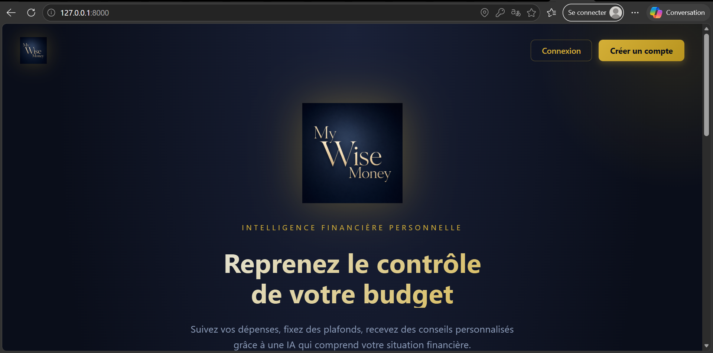
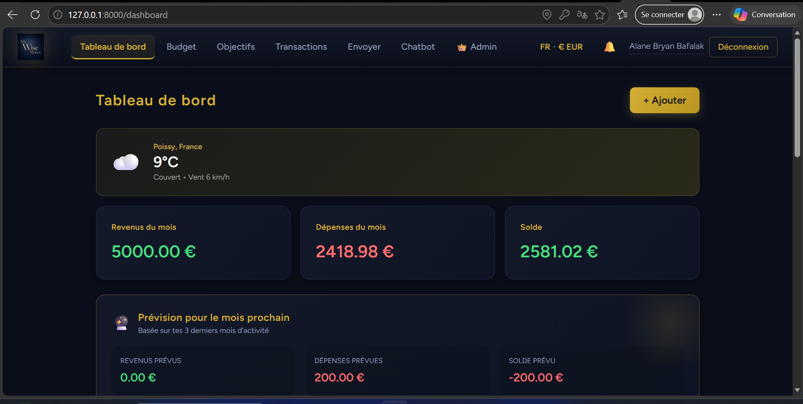
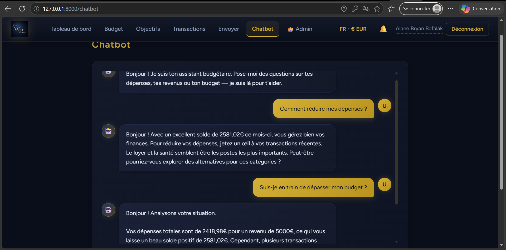

# My Wise Money
Nous allons concevoir une application qui analyse les dépenses d’un utilisateur et propose des recommandations d’épargne, de réduction de coûts et de catégorisation automatique des transactions.

<div align="center">


# My Wise Money

**Application web de gestion budgétaire personnelle avec assistant IA**

*Projet électif — Finance & Intelligence Artificielle*

[](https://laravel.com)
[](https://react.dev)
[](https://inertiajs.com)
[](https://www.sqlite.org)
[](https://ai.google.dev)

</div>

---

##  Présentation

**My Wise Money** est une application web complète qui aide les particuliers à reprendre le contrôle de leur budget grâce à :

-  Un tableau de bord visuel avec graphiques en temps réel
-  Un assistant conversationnel propulsé par Google Gemini, qui analyse vos données réelles
-  Un système d'objectifs d'épargne et de transactions récurrentes
-  Des transferts entre utilisateurs (simulation bancaire interne)
-  Une interface multilingue (10 langues) et multi-devises (12 devises)
-  Des prévisions de dépenses basées sur l'historique

---

##  Aperçu

<div align="center">



*Page d'accueil avec design impérial*

<br/>



*Tableau de bord avec graphiques, météo et prévisions IA*

<br/>



*Assistant conversationnel multilingue*

</div>

---

##  Fonctionnalités principales

###  Gestion budgétaire
- Tableau de bord avec revenus, dépenses, solde
- Graphiques évolution 6 mois (barres) et répartition par catégorie (camembert)
- Widget météo géolocalisé
- Prévision IA des revenus/dépenses du mois suivant

###  Transactions
- Création manuelle ou import CSV
- Filtrage par type (revenus / dépenses)
- Transactions récurrentes (quotidien, hebdo, mensuel, annuel)
- 7 catégories prédéfinies

###  Objectifs d'épargne
- Création d'objectifs avec montant cible et échéance
- Dépôts / retraits successifs
- Barres de progression visuelles
- 12 icônes disponibles

###  Budgets
- Plafonds par catégorie
- Alertes visuelles à 75% et 100% d'utilisation
- Barres de progression colorées

###  Transferts d'argent
- Envoyer à un autre utilisateur (instantané)
- Envoyer par IBAN (simulation virement externe)
- Demander de l'argent (avec acceptation / refus)
- Système de notifications avec badge

###  Chatbot IA
- Connecté à Google Gemini (gemini-2.5-flash-lite)
- Contexte enrichi (transactions, budgets, revenus/dépenses du mois)
- Suggestions de questions
- Répond dans la langue de l'utilisateur

###  Profil
- Modifier nom et email
- Changer le mot de passe
- Supprimer son compte

###  Administration
- Statistiques globales (utilisateurs, transactions, volumes)
- Liste des utilisateurs avec leurs activités
- Promouvoir / rétrograder les droits
- Supprimer un compte

###  Internationalisation
- **10 langues** : Français, English, Español, Deutsch, Italiano, Português, العربية, 中文, हिन्दी, Русский
- **12 devises** : EUR, USD, GBP, JPY, CNY, INR, CHF, CAD, AUD, XAF, BRL, RUB
- Support RTL pour l'arabe

---

##  Stack technique

| Couche | Technologies |
|--------|--------------|
| **Backend** | Laravel 12.58, PHP 8.2 |
| **Frontend** | React 18, Inertia.js 2.0, Vite |
| **Style** | CSS-in-JS (styles inline thématiques) |
| **Graphiques** | Recharts |
| **Base de données** | SQLite |
| **Authentification** | Laravel Breeze |
| **IA** | Google Gemini API (gemini-2.5-flash-lite) |
| **APIs externes** | Open-Meteo (météo), Nominatim (géocodage) |

---

##  Installation

### Prérequis
- PHP **8.2+**
- Composer
- Node.js **18+** et npm
- Git

### Étapes

```bash
# 1. Cloner le dépôt
git clone https://github.com/bbaf07/Budget-AI.git
cd Budget-AI

# 2. Installer les dépendances backend
composer install

# 3. Installer les dépendances frontend
npm install

# 4. Copier le fichier d'environnement
cp .env.example .env

# 5. Générer la clé d'application
php artisan key:generate

# 6. Créer la base de données SQLite
touch database/database.sqlite

# 7. Lancer les migrations
php artisan migrate

# 8. (Optionnel) Ajouter la clé Gemini dans .env
# GEMINI_API_KEY=ta_clé_ici
```

### Lancer l'application

Dans **deux terminaux séparés** :

```bash
# Terminal 1 — Serveur Laravel
php artisan serve
```
```bash
# Terminal 2 — Serveur Vite
npm run dev
```

L'application est accessible sur **http://127.0.0.1:8000**

---

##  Structure du projet
my-wise-money/
├── app/
│   ├── Http/
│   │   ├── Controllers/      # 8 controllers (Transaction, Budget, Goal, Money...)
│   │   └── Middleware/       # AdminMiddleware, HandleInertiaRequests
│   └── Models/               # User, Transaction, Budget, Goal, MoneyRequest...
├── database/
│   ├── migrations/           # Schémas des tables
│   └── database.sqlite       # Base de données
├── resources/
│   └── js/
│       ├── Components/       # WeatherWidget
│       ├── Layouts/          # AuthenticatedLayout (navbar, notifs)
│       ├── lib/i18n.js       # Traductions + devises
│       └── Pages/
│           ├── Auth/         # Login, Register
│           ├── Admin/        # Dashboard admin
│           ├── Dashboard.jsx
│           ├── Transactions.jsx
│           ├── Budget.jsx
│           ├── Goals.jsx
│           ├── Money.jsx
│           ├── Chatbot.jsx
│           ├── Profile.jsx
│           └── Welcome.jsx
├── routes/
│   └── web.php               # Toutes les routes
└── public/
└── images/logo.png       # Logo de l'application
```sh
---

##  Design

L'interface adopte un thème **"impérial bleu sombre"** :

- **Fond** : bleu nuit (`#0a0e1a`)
- **Cartes** : bleu marine (`#141929`)
- **Accents** : or (`#d4af37`)
- **Texte principal** : blanc bleuté (`#e8eef7`)

Le design est cohérent à travers toutes les pages, avec des dégradés subtils, des ombres profondes et des animations fluides.

---

##  Équipe

| Membre | Rôle |
|--------|------|
| **Membre 1** | Frontend React + UI/UX |
| **Membre 2** | Backend Laravel + Base de données + Import CSV |
| **Membre 3** | IA + Chatbot Gemini |
| **Membre 4** | Tests + Visualisations + Documentation |

---

##  Routes principales

| Méthode | URL | Description |
|---------|-----|-------------|
| GET | `/` | Page d'accueil |
| GET | `/dashboard` | Tableau de bord |
| GET, POST | `/transactions` | Liste / création |
| POST | `/transactions/import` | Import CSV |
| GET, POST | `/budget` | Plafonds par catégorie |
| GET, POST | `/goals` | Objectifs d'épargne |
| GET, POST | `/money` | Transferts d'argent |
| POST | `/chatbot/message` | Question au chatbot |
| GET | `/weather` | API météo géolocalisée |
| POST | `/preferences` | Changer devise / langue |
| GET | `/admin/dashboard` | Panel admin |

---

##  Améliorations futures

- [ ] Historique des conversations chatbot persisté en base
- [ ] Export PDF du tableau de bord
- [ ] Application mobile (React Native)
- [ ] Mode invité / démo sans inscription
- [ ] Statistiques avancées sur 1 an
- [ ] Notifications push
- [ ] Conteneurisation Docker

---

##  Licence

Projet académique — usage pédagogique uniquement.

---

<div align="center">

** Réalisé dans le cadre du cours électif Finance & IA**

</div>
```